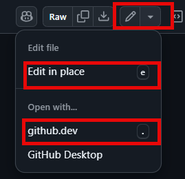

---
lab:
  title: 'Laboratorio 03: Automatización de Azure Load Testing mediante Acciones de GitHub '
  module: 'Module 3: Implement Azure Load Testing'
---

# Información general

En este laboratorio aprenderás a configurar Acciones de GitHub para implementar una aplicación web de ejemplo e iniciar una prueba de carga mediante Azure Load Testing.

En este laboratorio, aprenderá a:

* Cree recursos de App Service y Load Testing en Azure.
* Cree y configure una entidad de servicio para permitir que los flujos de trabajo de Acciones de GitHub realicen acciones en su cuenta de Azure.
* Implemente una aplicación de .NET 8 en Azure App Service mediante un flujo de trabajo de Acciones de GitHub.
* Actualice un flujo de trabajo de Acciones de GitHub para invocar una prueba de carga basada en direcciones URL.

**Tiempo estimado de finalización: 40 minutos**

## Requisitos previos

* Una **cuenta de Azure** con una suscripción activa. Si aún no tiene una, puede solicitar una prueba gratuita en [https://azure.com/free](https://azure.com/free).
    * Un [explorador](https://learn.microsoft.com/azure/azure-portal/azure-portal-supported-browsers-devices) compatible con el portal web de Azure.
    * Una cuenta Microsoft o una cuenta de Microsoft Entra con el rol Colaborador o Propietario en la suscripción de Azure. Para más información, consulte [Enumeración de asignaciones de roles de Azure mediante Azure Portal](https://docs.microsoft.com/azure/role-based-access-control/role-assignments-list-portal) y [Ver y asignar roles de administrador en Azure Active Directory](https://docs.microsoft.com/azure/active-directory/roles/manage-roles-portal).
* Una cuenta de GitHub. Si no tiene una cuenta de GitHub que pueda usar para este laboratorio, siga las instrucciones disponibles en [Registrar una nueva cuenta GitHub](https://github.com/join) para crear una.


## Instrucciones

## Ejercicio 1: Importación de la aplicación de muestra al repositorio de GitHub

En este ejercicio, importarás el repositorio [Aplicación de ejemplo de prueba de carga de Azure](https://github.com/MicrosoftLearning/azure-load-test-sample-app) a tu propia cuenta de GitHub.

### Tarea 1: Importar el repositorio de eShopOnWeb

1. En tu explorador web ve a GitHub [http://github.com](http://github.com) e inicia sesión con tu cuenta.
1. Inicia el proceso de importación [https://github.com/new/import](https://github.com/new/import).
1. Escribe la siguiente información en la página **Importa el proyecto a GitHub**.

    | Configuración | Acción |
    |--|--|
    | **Dirección URL del repositorio de origen** | Escriba `https://github.com/MicrosoftLearning/azure-load-test-sample-app`. |
    | **Propietario** | Selecciona tu alias de GitHub |
    | **Nombre del repositorio** | Asigna un nombre al repositorio |
    | **Privacidad** | Después de seleccionar el **Propietario** aparecerán las opciones de privacidad. Seleccione **Público**. |

1. Selecciona **Comenzar importación** y espera a que se complete el proceso de importación.
1. En la página del nuevo repositorio selecciona **Configuración**, después selecciona **Acciones > General** en el panel de navegación izquierdo.
1. En la sección **Permisos de acciones** de la página, selecciona la opción **Permitir todas las acciones y flujos de trabajo reutilizables** y después selecciona **Guardar**.

## Ejercicio 2: Creación de recursos en Azure

En este ejercicio, crearás los recursos de Azure necesarios para implementar la aplicación y ejecutar la prueba. 

### Tarea 1: Crear recursos con la CLI de Azure

En esta tarea se crean los siguientes recursos de Azure:

* Resource group
* Plan de App Service
* Instancia de App Service
* Instancia de prueba de carga

1. En tu explorador ve a Azure Portal [https://portal.azure.com](https://portal.azure.com).
1. Abre el **Cloud shell** y selecciona el modo **Bash**. **Nota:** Es posible que tengas que configurar el almacenamiento persistente si es la primera vez que inicias Cloud Shell.

1. Ejecuta los siguientes comandos de uno en uno para crear variables usadas en los comandos del resto de los pasos. Reemplaza `<mylocation>` por tu ubicación preferida.

    ```
    myLocation=<mylocation>
    myAppName=az2006app$RANDOM
    ```
1. Ejecuta el siguiente comando para crear el grupo de recursos que contenga los demás recursos.

    ```
    az group create -n az2006-rg -l $myLocation
    ```

1. Ejecuta el siguiente comando para registrar el proveedor de recursos para el **Azure App Service**.

    ```bash
    az provider register --namespace Microsoft.Web
    ```

1. Ejecuta el siguiente comando para crear el plan de App Service. **Nota:** El plan B1 usado en el plan de App Service puede incurrir en costes. 

    ```
    az appservice plan create -g az2006-rg -n az2006webapp-plan --sku B1
    ```

1. Ejecuta el siguiente comando para crear la instancia de App Service para la aplicación.

    ```
    az webapp create -g az2006-rg -p az2006webapp-plan -n $myAppName --runtime "dotnet:8"
    ```

1. Ejecuta el siguiente comando para crear un recurso de prueba de carga. Si se te pide que instales la extensión **Cargar** elige Sí.

    ```
    az load create -n az2006loadtest -g az2006-rg --location $myLocation
    ```

1. Ejecuta los siguientes comandos para recuperar tu Id. de suscripción. **Nota:** Asegúrate de copiar y guardar la salida de los comandos, el valor de Id. de suscripción se usa más adelante en este laboratorio.

    ```
    subId=$(az account list --query "[?isDefault].id" --output tsv)
    
    echo $subId
    ```

### Tarea 2: Crear la entidad de servicio y configurar la autorización

En esta tarea, crearás una entidad de servicio para la aplicación y la configurarás para la autenticación federada de OpenID Connect.

1. En Azure Portal busca **Microsoft Entra ID** y ve al servicio.

1. En el panel de navegación izquierdo, selecciona **Registros de aplicaciones** del grupo **Administrar**. 

1. Selecciona **+ Nuevo registro** en el panel principal e introduce `GH-Action-webapp` en Nombre y después selecciona **Registrar**.

    >**IMPORTANTE:** Copia y guarda los valores de **Id. de aplicación (cliente)** e **Id de directorio (inquilino)** para más adelante en este laboratorio.


1. En el panel de navegación izquierdo, seleccione **Certificados y secretos** en el grupo **Administrar** y, a continuación, en la ventana principal, seleccione **Credenciales federadas**. 

1. Selecciona **Agregar una credencial** y después selecciona **Acciones de GitHub que implementan recursos de Azure** en el desplegable de selección.

1. Escribe la siguiente información en la sección **Conectar la cuenta de GitHub**. **Nota:** Estos campos distinguen mayúsculas de minúsculas. 

    | Campo | Action |
    |--|--|
    | Organización | Escriba el nombre del usuario o la organización. |
    | Repositorio | Escribe el nombre del repositorio que has creado anteriormente en el laboratorio. |
    | Tipo de entidad | Seleccione **Rama**. |
    | Nombre de la rama de GitHub | Escribe **principal**. |

1. En la sección **Detalles de credenciales** asigna un nombre a tu credencial y después selecciona **Agregar**.

### Tarea 3: Asignar roles a la entidad de servicio

En esta tarea, asignarás los roles necesarios a la entidad de servicio para acceder a los recursos.

1. Ejecuta los siguientes comandos para asignar el rol "Colaborador de pruebas de carga" para que el flujo de trabajo de GitHub pueda enviar las pruebas de recursos a ejecutar. 

    ```
    spAppId=$(az ad sp list --display-name GH-Action-webapp --query "[].{spID:appId}" --output tsv)

    loadTestId=$(az resource show -g az2006-rg -n az2006loadtest --resource-type "Microsoft.LoadTestService/loadtests" --query "id" -o tsv)

    az role assignment create --assignee $spAppId --role "Load Test Contributor"  --scope $loadTestId
    ```

1. Ejecuta el siguiente comando para asignar el rol "colaborador" para que el flujo de trabajo de GitHub pueda implementar la aplicación en App Service. 

    ```
    rgId=$(az group show -n az2006-rg --query "id" -o tsv)
    
    az role assignment create --assignee $spAppId --role contributor --scope $rgId
    ```

## Ejercicio 3: Implementación y prueba de la aplicación web mediante Acciones de GitHub

En este ejercicio, configurarás el repositorio para ejecutar los flujos de trabajo incluidos.

* Los flujos de trabajo se encuentran en la carpeta *.github/workflows* del repositorio.
* Ambos flujos de trabajo, *deploy.yml* y *loadtest.yml* están configurados para ejecutarse manualmente.

Durante este ejercicio se editan los archivos del repositorio en el explorador. Después de seleccionar un archivo para editarlo, puedes:
* Selecciona **Editar en su lugar** y, cuando termines de editar, confirma los cambios. 
* Abre el archivo con **github.dev** para editarlo con Visual Studio Code en el explorador. Si eliges esta opción puedes volver a la experiencia de repositorio predeterminada al seleccionar **Volver al repositorio** en el menú superior.

    

### Tarea 1: Configurar secretos

En esta tarea, agregarás secretos al repositorio para permitir que los flujos de trabajo inicien sesión en Azure en tu nombre y realicen acciones.

1. En el explorador web, ve a [GitHub](https://github.com) y selecciona el repositorio que has creado para este laboratorio. 
1. Selecciona **Configuración** en la parte superior del repositorio.
1. En el panel de navegación izquierdo, selecciona **Secretos y variables** y después **Acciones**.
1. En la sección **Secretos de repositorio** agrega los siguientes tres secretos. Para agregar un secreto, selecciona **Nuevo secreto de repositorio**.

    | Nombre | Secreto |
    |--|--|
    | `AZURE_CLIENT_ID` | Escribe el **Id. de aplicación (cliente)** que has guardado anteriormente en el laboratorio. |
    | `AZURE_TENANT_ID` | Escribe el **Id. de directorio (inquilino)** que has guardado anteriormente en el laboratorio. |
    | `AZURE_SUBSCRIPTION_ID` | Escribe el valor del Id. de suscripción que has guardado anteriormente en el laboratorio. |

### Tarea 2: Implementar la aplicación web

1. Selecciona el archivo *deploy.yml* en la carpeta *.github/workflows*.

1. Edita el archivo y, en la sección **env:**, cambia el valor de la variable `AZURE_WEB_APP`. Reemplaza `<your web app name>` por el nombre de la aplicación web creada anteriormente en este laboratorio. Confirme el cambio.

1. Dedica un tiempo a revisar el contenido del flujo de trabajo.

1. Selecciona **Acciones** en la navegación superior de tu repositorio. 

1. Selecciona **Compilar y publicar** en el panel de navegación izquierdo.

1. Selecciona el desplegable **Ejecutar flujo de trabajo** y selecciona **Ejecutar flujo de trabajo** manteniendo la configuración predeterminada **Rama: principal**. El flujo de trabajo puede tardar un poco en iniciarse.

Si hay problemas para que el flujo de trabajo se complete correctamente, selecciona el flujo de trabajo **Compilar y publicar** y después selecciona **compilar** en la siguiente pantalla. Proporcionará información detallada sobre el flujo de trabajo y puede ayudar a diagnosticar qué problema impedía que se completara correctamente.

### Tarea 3: Ejecutar una prueba de carga

1. Selecciona el archivo *loadtest.yml* en la carpeta *.github/workflows*.

1. Edita el archivo y, en la sección **env:**, cambia el valor de la variable `AZURE_WEB_APP`. Reemplaza `<your web app name>**` por el nombre de la aplicación web creada anteriormente en este laboratorio. Confirme el cambio.

1. Dedica un tiempo a revisar el contenido del flujo de trabajo.

1. Selecciona **Acciones** en la navegación superior de tu repositorio. 

1. Selecciona **Prueba de carga** en el panel de navegación izquierdo.

1. Selecciona el desplegable **Ejecutar flujo de trabajo** y selecciona **Ejecutar flujo de trabajo** manteniendo la configuración predeterminada **Rama: principal**. El flujo de trabajo puede tardar un poco en iniciarse.

    >**NOTA:** El flujo de trabajo puede tardar entre 5 y 10 minutos en completarse. La prueba se ejecuta durante dos minutos, y la prueba de carga puede tardar varios minutos en ponerse en cola e iniciarse en Azure. 

Si hay problemas para que el flujo de trabajo se complete correctamente, selecciona el flujo de trabajo **Compilar y publicar** y después selecciona **compilar** en la siguiente pantalla. Proporcionará información detallada sobre el flujo de trabajo y puede ayudar a diagnosticar qué problema impedía que se completara correctamente.

#### Opcionales

El archivo *config.yaml* de la raíz del repositorio especifica los criterios de error de la prueba de carga. Si deseas forzar que se produzca un error en la prueba de carga, realiza los pasos siguientes.

1. Edita el archivo *config.yaml* ubicado en la raíz del repositorio.
1. Cambia el valor del campo `- p90(response_time_ms) > 4000` a un valor bajo. Cambiarlo a `- p90(response_time_ms) > 50` probablemente hará que se produzca un error en la prueba. Esto representa que la aplicación responderá en un plazo de 50 ms el 90 % del tiempo. 

### Tarea 4: Visualizar los resultados de la prueba de carga

Al ejecutar una prueba de carga desde la canalización de CI/CD, podrá ver los resultados del resumen directamente en el registro de salida de CI/CD. Dado que los resultados de la prueba se guardaron como un artefacto de canalización, también puedes descargar un archivo .csv para generar informes adicionales.


## Ejercicio 4: Limpieza de recursos

En este ejercicio, eliminarás los recursos creados anteriormente en el laboratorio.

1. Ve a Azure Portal [https://portal.azure.com](https://portal.azure.com) e inicia Cloud Shell. Selecciona la sesión de shell **Bash**.

1. Ejecuta el siguiente comando para eliminar el grupo de recursos `az2006-rg`. También quitarás el plan de App Service y la instancia de App Service.

    ```
    az group delete -n az2006-rg --no-wait --yes
    ```

    >**Nota**: El comando se ejecuta de forma asíncrona (configurado con el parámetro `--no-wait`), por lo que, aunque puedes ejecutar otro comando de la CLI de Azure inmediatamente después en la misma sesión de Bash, los grupos de recursos tardarán unos minutos en quitarse.

## Revisar

En este laboratorio, has implementado flujos de trabajo de Acción de GitHub que implementan y prueban la carga de una aplicación web de Azure.
